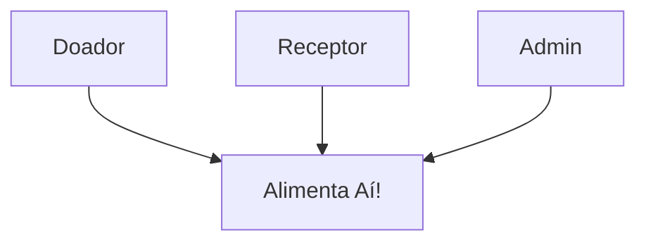
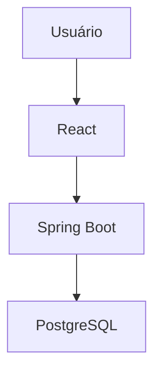
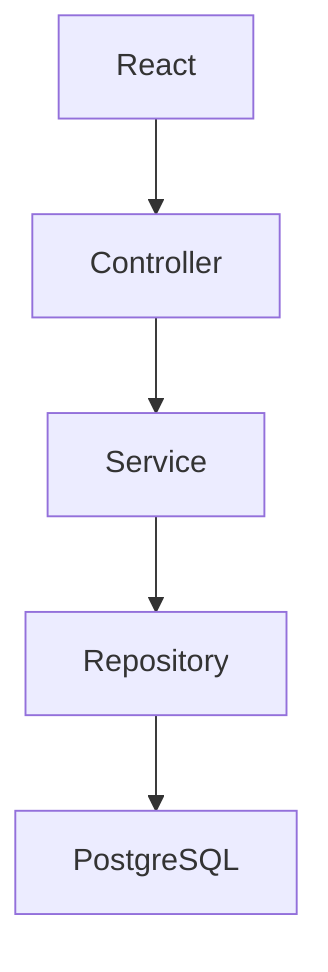

# Arquitetura - Alimenta Aí!

## Diagrama de Contexto

## Diagrama de Containers

## Diagrama de Componentes

## Tecnologias

- Java 21 + Spring Boot
- React 18
- PostgreSQL 15

## Justificativas

1. Java + Spring Boot: segurança e tipagem forte
2. PostgreSQL: evita que dois peguem a mesma doação
3. React: interface rápida
